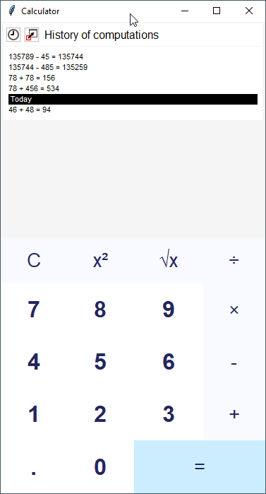

## Preamble

This is a fork of calculator app from the repository https://github.com/BaseMax/TkinterCalculator

## Tkinter Calculator (Python)

<div style="text-align:center">



</div>

Calculator application created by Python powered by Tkinter. (GUI Calculator)
For now it supports basic operations such as addition, subtraction, multiplication and division.

It also supports the history of performed operations - one of the main features, which is one of the main goals
for the application

Planned features:
- support for python assignment statements to store a value is a defined variable,
- parsing the whole history at startup, so the execution follows to a point where user can reference previously calculated variables,
- making an installer that allows to install the calulator as the default Windows calculator application (which can be launched through a calculator button on the keyboard) if it fits the user,
- and a lot more (graphing, simple equations solving, statistics, you name it)

## Running

For now you have to manually run the calculator by executing it from the command line.

```bash
$ python app.py
```

Since there are no external dependencies, you can be sure it will run with recent versions of Python 3
